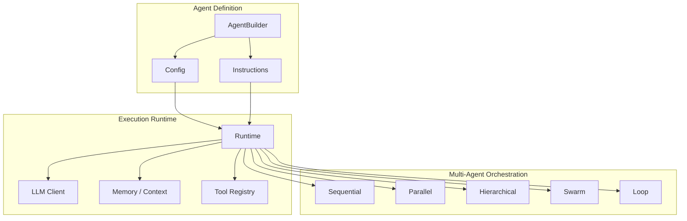
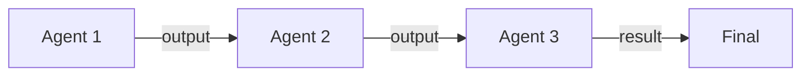
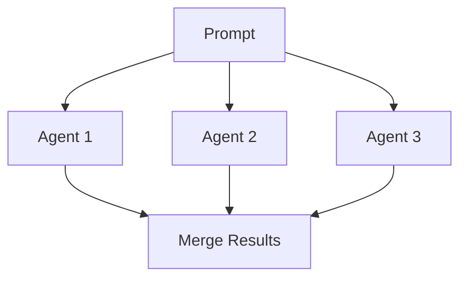
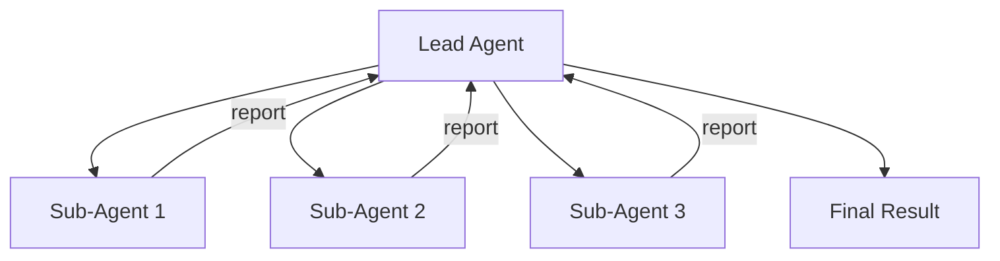
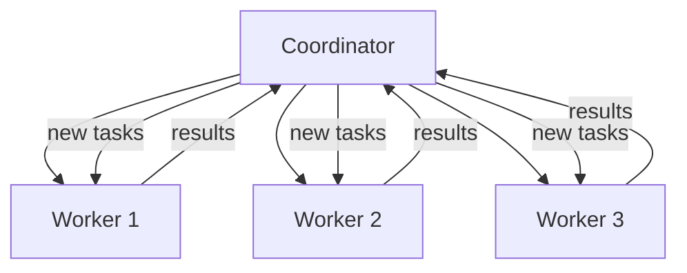
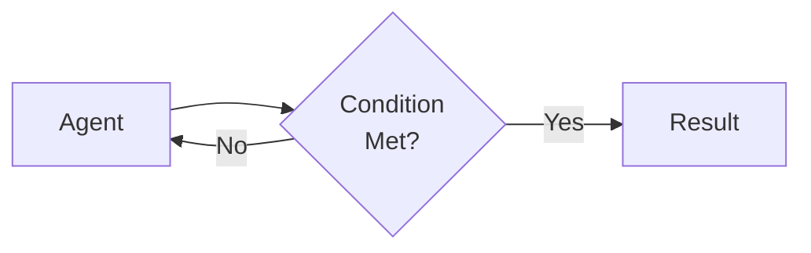

# Agency Framework

**Agency** is Chasm's Rust-native framework for building, orchestrating, and deploying AI agents. It provides a complete toolkit for creating autonomous agents that can reason, use tools, and collaborate in multi-agent workflows.

## Architecture



## Agent Builder

Agents are defined with a fluent builder API:

```rust
use chasm::agency::{AgentBuilder, AgentRole, Tool};

let agent = AgentBuilder::new("my-agent")
    .role(AgentRole::Coder)
    .model("gemini-2.0-flash")
    .instruction("You are a Rust expert. Write idiomatic, safe code.")
    .temperature(0.3)
    .max_tool_calls(20)
    .tool(Tool::file_read())
    .tool(Tool::file_write())
    .tool(Tool::terminal())
    .build();
```

### Configuration

| Parameter | Type | Default | Description |
|---|---|---|---|
| `name` | `String` | Required | Agent identifier |
| `role` | `AgentRole` | `Custom` | Agent role (affects default behavior) |
| `model` | `String` | `gemini-2.0-flash` | LLM model to use |
| `instruction` | `String` | Role-based default | System prompt |
| `temperature` | `f32` | `0.7` | Sampling temperature |
| `max_tool_calls` | `usize` | `10` | Max tool calls per turn |
| `tools` | `Vec<Tool>` | `[]` | Available tools |

## Agent Roles

Each role provides sensible defaults for instruction, temperature, and tool selection:

| Role | Default Temp | Default Tools | Behavior |
|---|---|---|---|
| `Coordinator` | 0.5 | delegation | Breaks tasks down, delegates to others |
| `Researcher` | 0.5 | web_search, file_read | Gathers and analyzes information |
| `Coder` | 0.3 | file_read, file_write, terminal | Writes and modifies code |
| `Reviewer` | 0.3 | file_read | Reviews code, provides feedback |
| `Executor` | 0.2 | terminal | Runs commands and tools |
| `Writer` | 0.7 | file_read, file_write | Documentation and content |
| `Tester` | 0.3 | file_read, file_write, terminal | Writes and runs tests |
| `Analyst` | 0.5 | file_read | Data analysis and insights |

## Tool System

### Built-in Tools

| Tool | Description |
|---|---|
| `file_read` | Read file contents |
| `file_write` | Create or modify files |
| `terminal` | Execute shell commands |
| `web_search` | Search the web |
| `delegation` | Delegate to sub-agents |

### Custom Tools

Register custom functions as tools:

```rust
use chasm::agency::{Tool, ToolSchema};

let my_tool = Tool::custom("database_query")
    .description("Execute a SQL query against the project database")
    .parameter("query", "SQL query string", true)
    .parameter("database", "Database name", false)
    .handler(|params| async {
        let query = params.get("query").unwrap();
        // Execute query...
        Ok(json!({"rows": results}))
    })
    .build();
```

## Orchestration Modes

### Single

Standard single-agent execution. One agent processes the full request.

```bash
chasm agency run --agent coder "Fix the authentication bug"
```

### Sequential

Agents execute one after another, each building on the previous output:



```bash
chasm agency run --orchestration sequential "Build and test a REST API"
```

### Parallel

Multiple agents work simultaneously on independent subtasks:



```bash
chasm agency run --orchestration parallel "Research AI, blockchain, and quantum"
```

### Hierarchical

A lead agent delegates to specialized sub-agents:



### Swarm

A coordinator manages a pool of worker agents, dynamically assigning tasks:



```bash
chasm agency run --orchestration swarm "Design a microservices architecture"
```

### Loop

An agent repeats until a condition is satisfied:



## Memory & Context

Agents maintain context across tool calls within a session:

- **Short-term memory**: Current conversation context window
- **Tool results**: Output from tool invocations feeds back into context
- **Knowledge base** (optional): RAG-enhanced retrieval from document collections
- **Vector store** (optional): Semantic search across embeddings

## Advanced Features

### Proactive Agents

Autonomous agents that monitor conditions and take action:

```rust
use chasm::agency::{ProactiveMonitor, PermissionLevel};

let monitor = ProactiveMonitor::new(config)
    .permission_level(PermissionLevel::MediumRisk)
    .scan_interval(Duration::from_secs(3600));

monitor.start().await?;
```

### Multimodal (VLM/VLA)

Agents that process images and other media:

```rust
let vision_agent = AgentBuilder::new("analyst")
    .model("gemini-2.0-flash")
    .modality(ModelCategory::VLM)
    .build();
```

### Distributed Execution

Track and manage agent tasks across multiple machines:

```rust
let monitor = RemoteMonitor::new(config);
monitor.register_node("gpu-server", "192.168.1.100:8080").await?;
let task_id = monitor.submit_task(task).await?;
```

## REST API

The Agency framework is fully accessible via the REST API. See the [Agency REST API](../api/rest.md#agency-api) documentation for endpoints.
