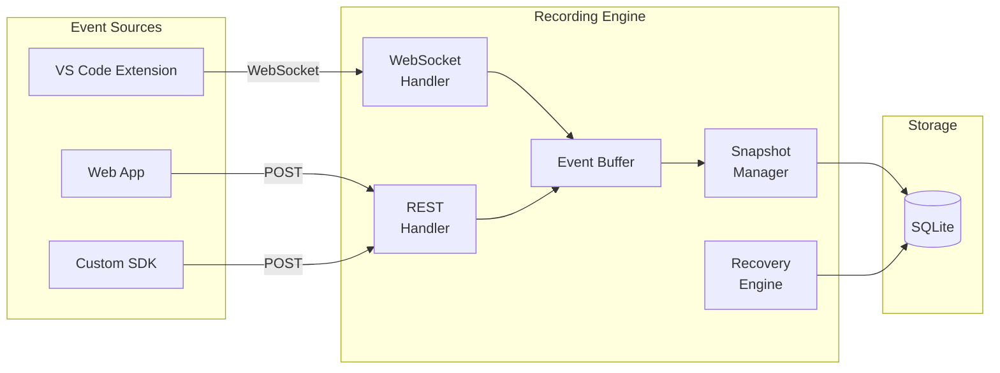
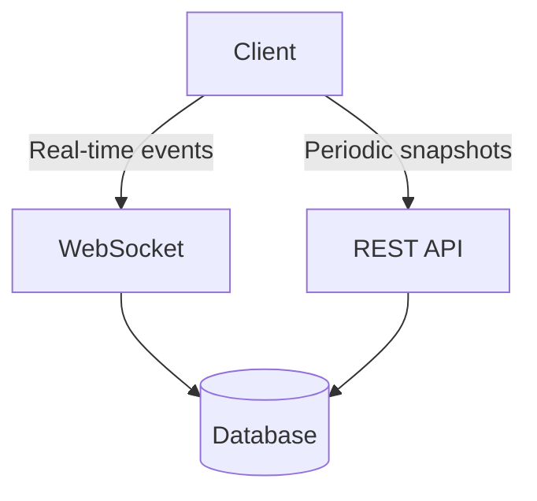
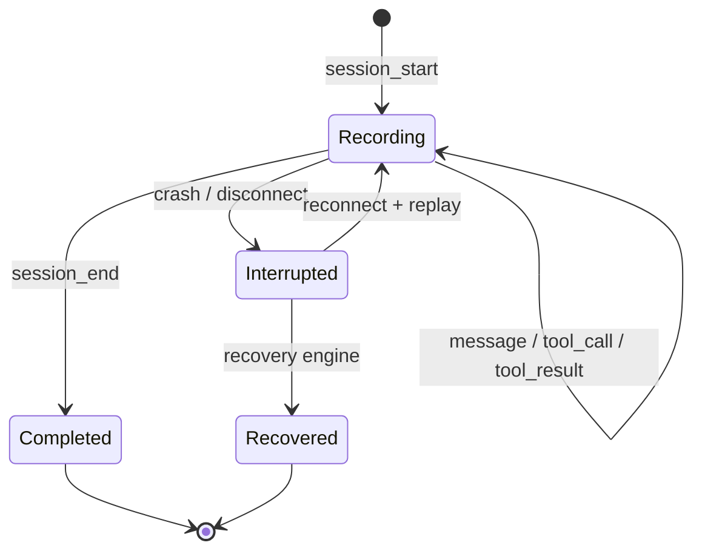

# Recording Engine

The recording engine captures chat sessions in real time, ensuring no data is lost — even if VS Code or the editor crashes mid-conversation.

## Overview



## Recording Modes

### Event Streaming (WebSocket)

The lowest-latency mode. Clients connect via WebSocket and stream individual events as they happen:

```
ws://localhost:8787/ws/recording
```

Events include:

| Event Type | Description |
|---|---|
| `session_start` | New conversation started |
| `message` | User or assistant message |
| `tool_call` | Tool invocation started |
| `tool_result` | Tool invocation completed |
| `session_end` | Conversation ended |

Each event is buffered and persisted immediately, so even if the connection drops, all events up to that point are saved.

### Snapshot (REST)

Periodic full-session snapshots sent via REST:

```http
POST /api/recording/snapshot
Content-Type: application/json

{
  "session_id": "abc123",
  "snapshot": {
    "title": "Debugging auth",
    "messages": [...]
  }
}
```

Snapshots are useful as a fallback — even if individual events are lost, the latest snapshot provides a complete picture.

### Hybrid Mode

The recommended mode: WebSocket for real-time events + periodic REST snapshots as a safety net.



## Event Buffer

Events are not written to SQLite individually (that would be too slow). Instead:

1. Events arrive via WebSocket or REST
2. Events are appended to an in-memory buffer
3. The buffer is flushed to SQLite periodically (every 1s or when the buffer reaches a threshold)
4. On flush, events are grouped by session and merged into the session record

This batching strategy provides both low latency (sub-second event capture) and high throughput (thousands of events per second).

## Crash Recovery

The recording engine is designed to survive crashes:

### Client-Side Recovery

If the WebSocket connection drops:

1. Client detects disconnection
2. Client buffers events locally
3. On reconnection, client sends buffered events with timestamps
4. Server deduplicates and merges

### Server-Side Recovery

If the Chasm server crashes:

1. On restart, the recovery engine runs automatically
2. In-memory buffer contents are recovered from the WAL (Write-Ahead Log)
3. Incomplete sessions are marked and can be manually recovered:

```bash
# Check for sessions that need recovery
curl http://localhost:8787/api/recording/recovery

# Or via CLI
chasm recover extract /path/to/project
```

## Session Lifecycle



## API Endpoints

| Method | Endpoint | Description |
|---|---|---|
| `POST` | `/api/recording/events` | Send recording events |
| `POST` | `/api/recording/snapshot` | Store session snapshot |
| `GET` | `/api/recording/sessions` | List active recordings |
| `GET` | `/api/recording/sessions/:id` | Get recorded session |
| `GET` | `/api/recording/recovery` | Recover crashed sessions |
| `GET` | `/api/recording/status` | Recording service health |

## Integration

### VS Code Extension

The Chasm VS Code extension automatically connects to the recording server and streams events:

```json
{
  "chasm.recording.enabled": true,
  "chasm.recording.server": "http://localhost:8787"
}
```

### Custom Integration

Any application can send recording events via the REST API:

```bash
# Start a recording session
curl -X POST http://localhost:8787/api/recording/events \
  -H "Content-Type: application/json" \
  -d '{
    "session_id": "my-session",
    "event_type": "session_start",
    "data": {"title": "My conversation"}
  }'

# Record a message
curl -X POST http://localhost:8787/api/recording/events \
  -H "Content-Type: application/json" \
  -d '{
    "session_id": "my-session",
    "event_type": "message",
    "data": {"role": "user", "content": "Hello!"}
  }'
```
