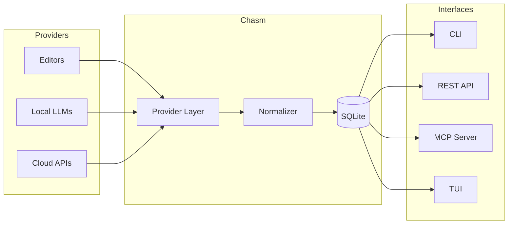

# Chasm

**Chat Session Manager** — Bridging the divide between AI providers.

<div class="grid cards" markdown>

-   :material-backup-restore: **Recover Lost Sessions**

    ---

    VS Code update wiped your chat history? Chasm recovers orphaned sessions, re-registers them, and makes them visible again.

    [:octicons-arrow-right-24: First Recovery](getting-started/first-recovery.md)

-   :material-database-search: **Search Everything**

    ---

    Full-text search across all your AI conversations — Copilot, Cursor, Claude, Ollama, and more.

    [:octicons-arrow-right-24: Harvest Guide](guides/recovery.md)

-   :material-package-variant-closed: **Single Binary**

    ---

    One `cargo install` gives you CLI, REST API, MCP server, TUI browser, and agent runtime.

    [:octicons-arrow-right-24: Installation](getting-started/installation.md)

-   :material-test-tube: **831 Tests Passing**

    ---

    Comprehensive test suite with 0 warnings, 0 errors. Battle-tested on real workspace data.

    [:octicons-arrow-right-24: Architecture](architecture/index.md)

</div>

## Quick Start

=== "Cargo"

    ```bash
    cargo install chasm
    chasm harvest run
    chasm harvest search "that thing I asked about"
    ```

=== "From Source"

    ```bash
    git clone https://github.com/nervosys/chasm.git
    cd chasm/chasm-rust
    cargo install --path .
    ```

## Core Use Cases

### 🔄 Recover Lost Chat Sessions

```bash
chasm fetch path /path/to/your/project
# Reload VS Code (Ctrl+R) → chat history restored
```

### 🔍 Search Across All Providers

```bash
chasm harvest run                          # Collect from all providers
chasm harvest search "react component"     # Full-text search
```

### 💬 Chat with Any Provider

```bash
chasm run ollama --model mistral           # Local
chasm run claude --model claude-sonnet-4-20250514  # Cloud
```

### 🤖 Multi-Agent Orchestration

```bash
chasm agency run --agent coder "Build a REST API in Rust"
chasm agency run --orchestration swarm "Design a microservices architecture"
```

## Supported Providers

| Category | Providers |
|---|---|
| **Editors** | GitHub Copilot, Cursor, Windsurf, Continue.dev, Claude Code, OpenCode, OpenClaw, Antigravity |
| **Local LLMs** | Ollama, LM Studio, GPT4All, LocalAI, llamafile |
| **Cloud APIs** | OpenAI / ChatGPT, Anthropic / Claude, Google / Gemini, Perplexity |

## Architecture Overview


