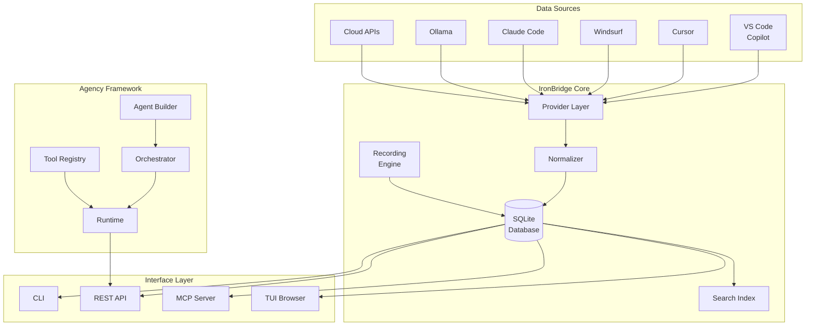

# Architecture

IronBridge is built as a modular Rust application with clearly separated concerns. This section covers the internal design.

-   :material-pipe: **Session Pipeline**

    ---

    How sessions flow from provider storage through normalization into the unified database.

    [:octicons-arrow-right-24: Session Pipeline](session-pipeline.md)

-   :material-swap-horizontal: **Provider System**

    ---

    The provider abstraction layer that normalizes 20+ AI assistant formats.

    [:octicons-arrow-right-24: Providers](providers.md)

-   :material-robot: **Agency Framework**

    ---

    The Rust-native agent development kit with multi-agent orchestration.

    [:octicons-arrow-right-24: Agency](agency.md)

-   :material-record-circle: **Recording Engine**

    ---

    Real-time session capture via WebSocket, REST, and hybrid modes.

    [:octicons-arrow-right-24: Recording](recording.md)

## High-Level Architecture

## Module Map

| Module | Path | Responsibility |
|---|---|---|
| `commands` | `src/commands/` | CLI command handlers |
| `providers` | `src/providers/` | Provider detection, parsing, normalization |
| `api` | `src/api/` | REST API server (Actix-web) |
| `mcp` | `src/mcp/` | MCP tool server |
| `agency` | `src/agency/` | Agent builder, orchestrator, tools |
| `tui` | `src/tui/` | Terminal UI (Ratatui) |
| `db` | `src/db/` | SQLite database layer |
| `models` | `src/models/` | Shared data structures |
| `recording` | `src/recording/` | Real-time session capture |
| `sync` | `src/sync/` | Bi-directional sync engine |

## Design Principles

1. **Zero vendor lock-in** — Every provider is abstracted behind a common trait. Switching providers requires no data migration.

2. **Offline-first** — All data lives locally in SQLite. Cloud features are opt-in. No account required.

3. **Single binary** — `cargo install ironbridge` gives you everything — CLI, API server, MCP server, TUI, and agency runtime.

4. **Type-safe normalization** — Provider-specific formats are parsed into strongly-typed Rust structs at the boundary. The rest of the system works with a single unified model.

5. **Composable interfaces** — CLI, REST, MCP, and TUI all share the same core logic. Adding a new interface means implementing a thin adapter.
