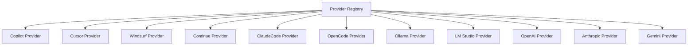

# Provider Architecture

The provider system is the extensibility layer that allows IronBridge to support 20+ AI assistants through a single unified interface.

## Provider Trait

Every provider implements a common trait:

```rust
pub trait Provider {
    /// Unique identifier for this provider
    fn name(&self) -> &str;

    /// Detect if this provider is available on the system
    fn detect(&self) -> Result<ProviderStatus>;

    /// Scan for available workspaces
    fn scan_workspaces(&self) -> Result<Vec<Workspace>>;

    /// Parse sessions from a workspace
    fn parse_sessions(&self, workspace: &Workspace) -> Result<Vec<Session>>;

    /// Provider-specific storage locations
    fn storage_paths(&self) -> Vec<PathBuf>;
}
```

This trait boundary isolates provider-specific format parsing from the rest of the system. The core pipeline only works with the unified `Session` model.

## Provider Registry

Providers are registered at startup:



When `ironbridge harvest scan` runs, the registry iterates over all registered providers, calling `detect()` on each to determine availability.

## Provider Categories

### Editor Providers

These parse session data from editor workspace storage on disk. They operate in **read mode** — scanning existing files without connecting to any service.

**Detection strategy**: Check for known directory structures and file patterns.

**Session format**: Varies by editor — VS Code uses SQLite + JSON, Cursor uses its own format, etc.

### Local LLM Providers

These connect to locally running AI inference servers via HTTP. They operate in **interactive mode** — sending prompts and receiving completions.

**Detection strategy**: HTTP health check on known default ports.

**Session format**: OpenAI-compatible chat completion API (most local LLMs support this).

### Cloud API Providers

These connect to hosted AI services. They operate in **interactive mode** with authentication.

**Detection strategy**: Check for API key environment variables.

**Session format**: Provider-specific API (OpenAI, Anthropic, Google, etc.).

## Adding a New Provider

To add support for a new AI assistant:

1. **Create the provider module** in `src/providers/`
2. **Implement the `Provider` trait**
3. **Register** the provider in the provider registry
4. **Add detection logic** for the provider's storage format
5. **Write parsing code** to convert provider-specific format → unified `Session`

### Example: Minimal Provider

```rust
pub struct MyProvider;

impl Provider for MyProvider {
    fn name(&self) -> &str {
        "my-provider"
    }

    fn detect(&self) -> Result<ProviderStatus> {
        if self.storage_paths().iter().any(|p| p.exists()) {
            Ok(ProviderStatus::Available)
        } else {
            Ok(ProviderStatus::NotFound)
        }
    }

    fn scan_workspaces(&self) -> Result<Vec<Workspace>> {
        // Scan storage paths for workspace folders
        todo!()
    }

    fn parse_sessions(&self, workspace: &Workspace) -> Result<Vec<Session>> {
        // Parse provider-specific files into unified Session format
        todo!()
    }

    fn storage_paths(&self) -> Vec<PathBuf> {
        vec![dirs::config_dir().unwrap().join("MyEditor/workspaceStorage")]
    }
}
```

## Format Normalization

Each provider maps its native format to the unified schema:

| Provider Field | Unified Field | Notes |
|---|---|---|
| Copilot `request` | `Message { role: User }` | Extracted from VS Code state DB |
| Copilot `response` | `Message { role: Assistant }` | May contain tool calls |
| Cursor `humanMessage` | `Message { role: User }` | Cursor-specific field name |
| Cursor `aiMessage` | `Message { role: Assistant }` | |
| Claude `human_turn` | `Message { role: User }` | From Claude conversation log |
| Claude `assistant_turn` | `Message { role: Assistant }` | May include artifacts |
| OpenAI `messages[].role` | Direct mapping | Already uses standard roles |

The normalization layer handles edge cases like:

- Missing timestamps (inferred from file modification time)
- Multi-part messages (concatenated into single content string)
- Nested tool invocations (flattened into `Vec<ToolInvocation>`)
- Provider-specific metadata (preserved in session metadata map)
