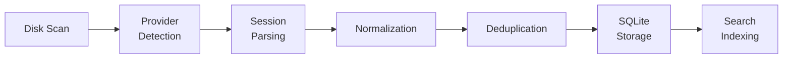

# Session Pipeline

The session pipeline is the core data flow in IronBridge — from raw provider files on disk to normalized sessions in the unified database.

## Pipeline Overview



## Stage 1: Disk Scan

IronBridge scans standard workspace storage locations for each supported editor. Paths vary by platform:

| Editor | Windows Path |
|---|---|
| VS Code | `%APPDATA%\Code\User\workspaceStorage\` |
| Cursor | `%APPDATA%\Cursor\User\workspaceStorage\` |
| Windsurf | `%APPDATA%\Windsurf\User\workspaceStorage\` |

Each workspace folder is identified by a hash of the project path. Inside, provider-specific files contain session data.

## Stage 2: Provider Detection

Each workspace folder is probed for known provider signatures:

- **Copilot**: Looks for `state.vscdb` or chat history files
- **Cursor**: Looks for Cursor-specific session storage
- **Continue.dev**: Looks for Continue configuration and session files
- **Claude Code**: Scans `~/.claude/` for conversation logs

The provider detection is extensible — adding a new provider means implementing the `Provider` trait.

## Stage 3: Session Parsing

Each provider has its own parser that reads raw session files and produces provider-specific intermediate structures. This is where format-specific logic lives:

- **JSON formats**: Parse workspace state databases
- **JSONL formats**: Stream line-delimited records
- **SQLite formats**: Query provider databases directly

## Stage 4: Normalization

Provider-specific structures are converted into the unified `Session` model:

```rust
pub struct Session {
    pub id: Uuid,
    pub title: String,
    pub provider: String,
    pub workspace_id: Uuid,
    pub created_at: DateTime<Utc>,
    pub updated_at: DateTime<Utc>,
    pub messages: Vec<Message>,
}

pub struct Message {
    pub role: Role,       // User, Assistant, System, Tool
    pub content: String,
    pub timestamp: DateTime<Utc>,
    pub tool_invocations: Vec<ToolInvocation>,
}
```

Key normalization steps:

1. **Role mapping** — Provider-specific role names → unified `Role` enum
2. **Timestamp extraction** — Some providers embed timestamps, others require inference
3. **Tool invocation parsing** — Normalize tool calls across Copilot, Cursor, and Claude formats
4. **Title generation** — If the provider doesn't set a title, IronBridge generates one from the first user message

## Stage 5: Deduplication

Before storage, sessions are checked for duplicates:

- **Exact match**: Same session ID from the same provider → skip
- **Content match**: Same messages with different IDs (e.g., after workspace hash change) → merge
- **Partial match**: Overlapping messages → extend the existing session

## Stage 6: Storage

Normalized sessions are written to the local SQLite database:

```
Workspaces ──< Sessions ──< Messages
                  │
                  ├──< Checkpoints
                  └──< ShareLinks
```

| Table | Purpose |
|---|---|
| `workspaces` | Project metadata, provider, path |
| `sessions` | Session metadata, title, timestamps |
| `messages` | Individual messages with role, content |
| `checkpoints` | Session state snapshots |
| `share_links` | Shared session access tokens |

## Stage 7: Search Indexing

After storage, session content is indexed for full-text search. The search index supports:

- Full-text queries: `ironbridge harvest search "authentication"`
- Workspace filtering
- Provider filtering
- Date range filtering

## Incremental Harvesting

The pipeline is designed for incremental operation. On subsequent runs:

1. Only new or modified workspace folders are scanned
2. Only new sessions are parsed and normalized
3. Deduplication prevents duplicates from repeated harvests
4. The search index is updated incrementally

```bash
# First run: full scan
ironbridge harvest run  # Scans everything

# Subsequent runs: incremental
ironbridge harvest run  # Only processes new/changed data
```

## Error Handling

The pipeline is fault-tolerant:

- **Corrupted files** → Logged and skipped, other sessions continue
- **Unknown formats** → Warning emitted, file skipped
- **Locked databases** → Retried with backoff
- **Partial sessions** → Stored with available data, flagged as incomplete
